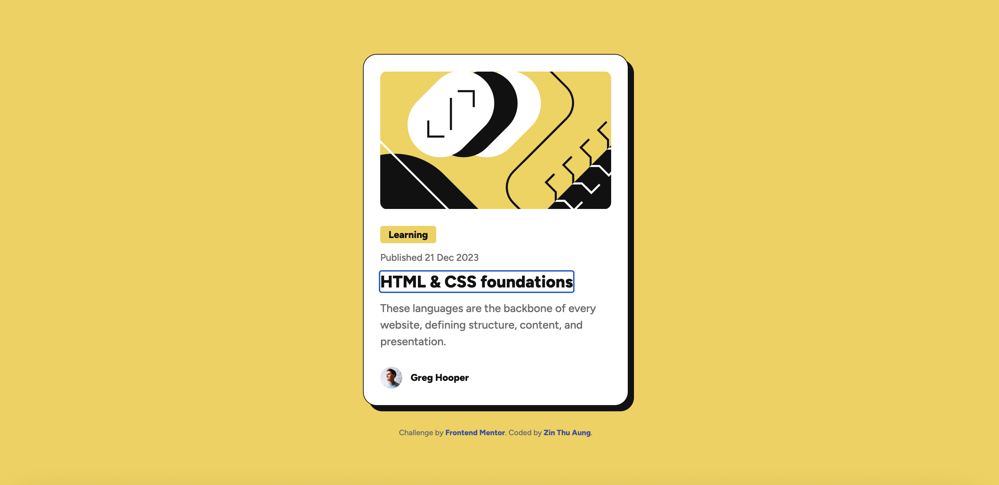
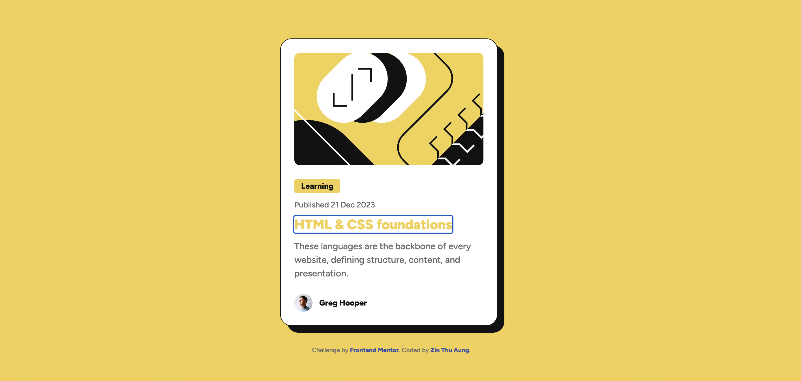
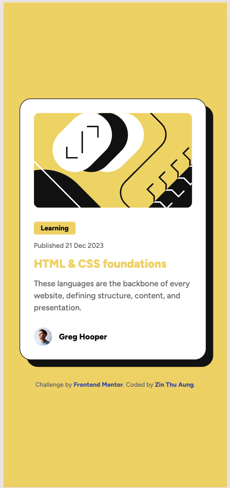

# Frontend Mentor - Blog preview card solution

This is a solution to the [Blog preview card challenge on Frontend Mentor](https://www.frontendmentor.io/challenges/blog-preview-card-ckbN1OCZOv). Frontend Mentor challenges help you improve your real-world coding skills by building realistic projects.

## Table of contents

- [Overview](#overview)
  - [The challenge](#the-challenge)
  - [Screenshot](#screenshot)
  - [Links](#links)
- [My process](#my-process)
  - [Built with](#built-with)
  - [What I learned](#what-i-learned)

### The challenge

Users should be able to:

- See hover and focus states for all interactive elements on the page
- View the optimal layout depending on their device's screen size (Responsive design across mobile and desktop viewports)

### Screenshot

### Links

- Solution URL: [https://github.com/ZinThuAung-LAB/Blog-Preview-Frontend_Mentor.git](https://github.com/ZinThuAung-LAB/Blog-Preview-Frontend_Mentor.git)
- Live Site URL: [https://github.com/ZinThuAung-LAB/Blog-Preview-Frontend_Mentor.git](https://github.com/ZinThuAung-LAB/Blog-Preview-Frontend_Mentor.git)

### Built with

- Semantic HTML5 markup
- CSS Custom Properties (Design tokens for Neo-brutalism color scheme)
- Flexbox layouts (Vertical centering and structure handling)
- Mobile-first responsive workflow
- Accessible `rem` units for typography and structural spacing

### What I learned

In this project, I implemented a robust **mobile-first workflow** and completely transitioned my layouts from pixel-based sizing to accessible **`rem`** tracking units. 

I also deep-dived into building a single-column flex container on the document root to perfectly drop components directly into the vertical center of the viewport, eliminating messy position bugs: